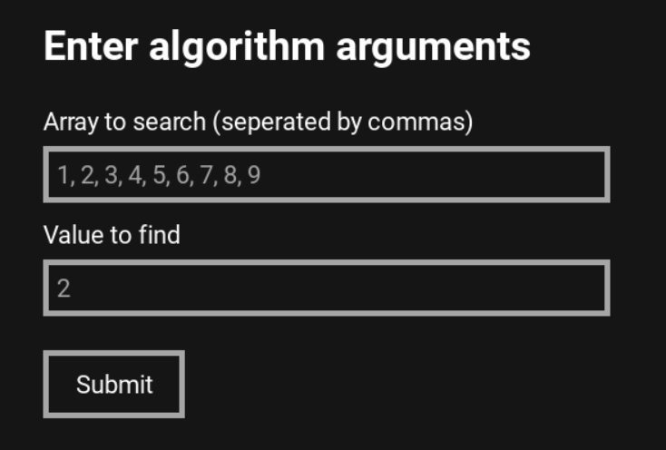
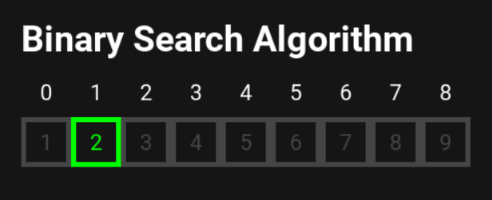

# AlgorithmVisualizer

## An algorithm visualizer built with Python and Pygame

Welcome to my Python algorithm visualizer! This project serves as a simple way to visually view simple data structures and the step-by-step process of common algorithms applied on them.

## Features

**Algorithms Available**

-   Binary Search Algorithm
-   Insertion Sort Algorithm

**Algorithms Being Added in the Future**

-   Merge Sort
-   Dijkstra’s Algorithm
-   And more to come!

## Screenshots

### Binary Search

 

